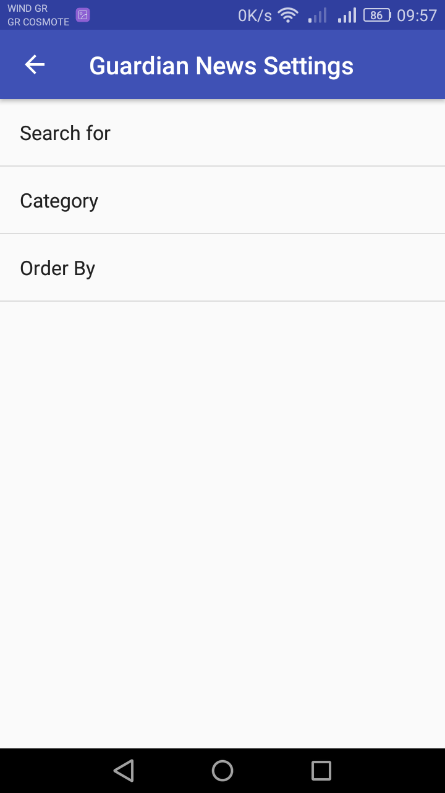
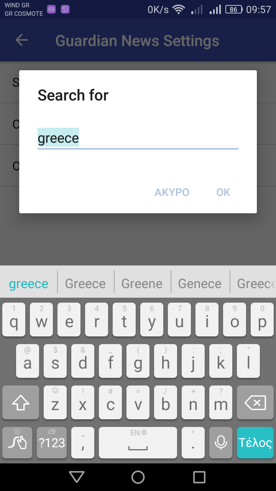
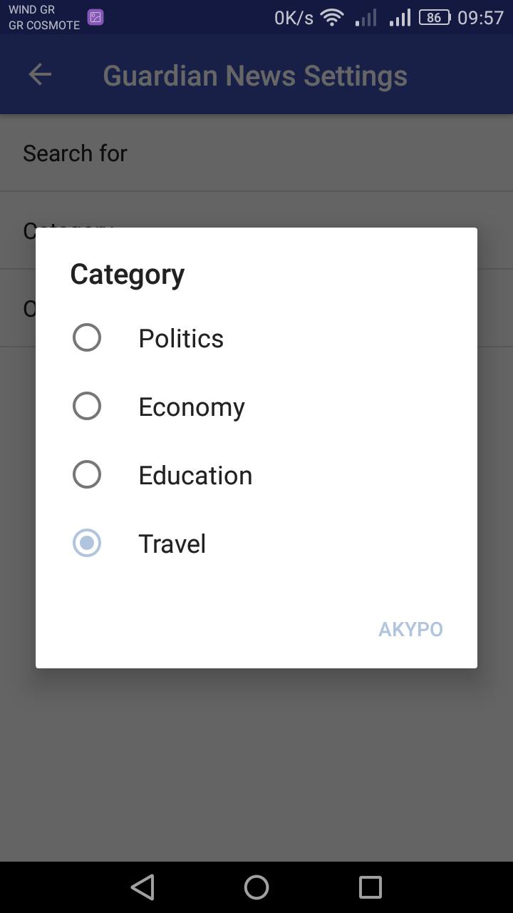
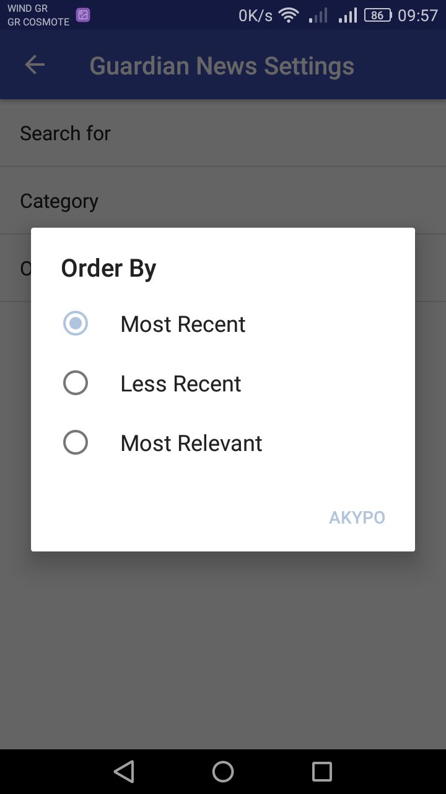

# NewsApp
NewsApp is a news feed app which gives a user regularly-updated news from the Guardian API, related to a particular topic, person, or location.

In this version of the app the user can select a keyword to search for news in the selected category, select a section/category for the news (like politics, economy, travel, etc) and order the results by time or relevance.

This is a project during udacity's nanodegree program courses.

<h2>App's screenshots</h2>

   

      

